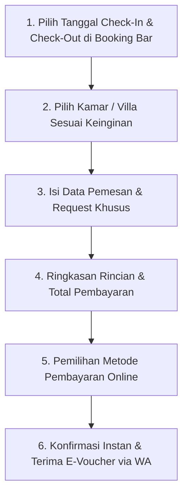

# BUKU PANDUAN PENGGUNAAN SISTEM (MANUAL BOOK)
## **Vije Boutique Resort — Luxury Hotel & Direct Booking Management System**

---

> **Dokumen Resmi:** Manual Book Operasional & Panduan Pengguna  
> **Target Sistem:** Website & Management Console Vije Boutique Resort ([www.vijeboutiqueresort.com](https://www.vijeboutiqueresort.com))  
> **Versi Aplikasi:** 1.0 (Quiet Luxury Edition)  
> **Penyusun:** Hasan Arofid — Senior Full-Stack & Hospitality Developer ([hasanarofid.site](https://hasanarofid.site))  
> **Tanggal Rilis:** September 2026  

---

## DAFTAR ISI

1. [Bab 1: Pendahuluan & Gambaran Umum Sistem](#bab-1-pendahuluan--gambaran-umum-sistem)
2. [Bab 2: Panduan Penggunaan Tamu (Guest Direct Booking Journey)](#bab-2-panduan-penggunaan-tamu-guest-direct-booking-journey)
3. [Bab 3: Panduan Operasional Administrator & Staf Hotel](#bab-3-panduan-operasional-administrator--staf-hotel)
4. [Bab 4: Panduan Pemeliharaan & Prosedur Teknis](#bab-4-panduan-pemeliharaan--prosedur-teknis)
5. [Bab 5: Pertanyaan Sering Diajukan & Penanganan Masalah (FAQ & Troubleshooting)](#bab-5-pertanyaan-sering-diajukan--penanganan-masalah-faq--troubleshooting)

---

## BAB 1: PENDAHULUAN & GAMBARAN UMUM SISTEM

### 1.1 Visi & Tujuan Sistem
Sistem **Vije Boutique Resort** dirancang khusus untuk memberikan pengalaman *digital hospitality* berkelas dunia dengan standar **"Quiet Luxury Boutique Resort"** (Inspirasi dari **Aman Resorts** & **Kempinski Hotels**). 

Sistem ini mengintegrasikan antarmuka publik visual yang menawan dengan **Direct Booking Engine** yang aman dan bebas komisi pihak ketiga (OTA), terhubung secara langsung ke panel kontrol operasional manajemen hotel (*Admin Dashboard*).

```
+-----------------------------------------------------------------------------------+
|                        EKOSISTEM SISTEM VIJE BOUTIQUE RESORT                      |
+-----------------------------------------------------------------------------------+
|  [ PUBLIC GUEST ]    : Landing Page -> Room Showcase -> Direct Checkout -> Voucher|
|  [ PAYMENT GATEWAY ] : Automated QRIS / Virtual Account / Credit Card Settlement  |
|  [ NOTIFICATION ]    : WhatsApp Instant E-Voucher & Email PDF Invoice Engine      |
|  [ ADMIN CONSOLE ]   : Occupancy Monitor -> Room Inventory -> Reservation Desk   |
+-----------------------------------------------------------------------------------+
```

---

### 1.2 Peran Pengguna & Matriks Hak Akses (RBAC Matrix)

Sistem ini menerapkan **Role-Based Access Control (RBAC)** untuk memastikan setiap staf hotel dan pengguna bekerja sesuai batasan wewenangnya:

| Peran (Role) | Hak Akses Utama | Tujuan & Tanggung Jawab |
| :--- | :--- | :--- |
| **Public Guest (Tamu)** | Akses Publik Landing Page, Reservasi Kamar, Checkout | Melihat profil resort, memilih tanggal menginap, membayar reservasi. |
| **Super Admin** | Akses Penuh (Full System Access) | Pengaturan konfigurasi utama sistem, manajemen seluruh akun & peran staf. |
| **Admin (General Manager)** | Pengelolaan Operasional & Inventaris | Meninjau laporan pendapatan, mengelola inventaris kamar, reservasi, & diskon. |
| **Reservation Staff** | Frontdesk & Resepsionis Hotel | Memproses reservasi masuk, Check-In / Check-Out tamu, input booking walk-in. |
| **Finance Officer** | Keuangan & Laporan Transaksi | Verifikasi transaksi pembayaran, laporan keuangan, & rekonsiliasi bank. |
| **Content Manager** | CMS & Media Galeri | Pengelolaan foto resort, promosi dining, fasilitas, & artikel cerita resort. |

---

## BAB 2: PANDUAN PENGGUNAAN TAMU (GUEST DIRECT BOOKING JOURNEY)

### 2.1 Menjelajahi Website Publik Resort

Tamu yang mengakses website [www.vijeboutiqueresort.com](https://www.vijeboutiqueresort.com) akan disambut oleh antarmuka minimalis elegan. Berikut bagian utama website:

1. **Full-Screen Immersive Hero:**
   - Menampilkan fotografi atmosfer resort resolusi tinggi dengan navigasi transparan.
   - Tombol **"Book Your Stay"** membawa langsung ke formulir pencarian tanggal.
2. **Editorial Introduction:**
   - Narasi pengantar keindahan alam dan konsep *slow living* di Vije Boutique Resort.
3. **Rooms & Suites Showcase:**
   - Katalog interaktif pilihan kamar/villa (*Grand Ocean Pool Villa*, *Sanctuary Garden Suite*, *Royal Residence*, dll.) lengkap dengan harga per malam, kapasitas, ukuran ($m^2$), dan amenitas eksklusif.
4. **Experience & Dining Showcase:**
   - Informasi tentang fasilitas spa & wellness, restoran private dining, infinity pool, dan tur lokal.
5. **Immersive Masonry Gallery:**
   - Galeri foto resolusi tinggi gaya majalah travel mewah.

---

### 2.2 Langkah-Langkah Pemesanan Kamar Langsung (Direct Booking Steps)



#### Detail Petunjuk Langkah:

#### **Langkah 1: Pencarian Ketersediaan Tanggal**
1. Pada **Floating Booking Bar** di bagian atas atau hero section, pilih:
   - **Check-In Date:** Tanggal mulai menginap.
   - **Check-Out Date:** Tanggal selesai menginap.
   - **Guests:** Jumlah tamu (Dewasa & Anak).
2. Klik tombol **"Check Availability"**.

#### **Langkah 2: Memilih Kamar / Villa**
1. Sistem akan menampilkan pilihan villa yang **tersedia** pada tanggal yang dipilih.
2. Klik **"Explore Details"** untuk melihat galeri foto kamar, pilihan ranjang, spesifikasi luas, dan daftar amenitas (kolam renang pribadi, butler 24/7, Sarapan gratis, dsb).
3. Klik tombol **"Reserve This Villa"**.

#### **Langkah 3: Mengisi Formulir Data Tamu**
Isi informasi pemesan secara presisi:
- **Nama Lengkap:** Sesuai KTP / Paspor.
- **Alamat Email:** Untuk pengiriman E-Voucher PDF & resi tagihan.
- **Nomor WhatsApp:** Untuk pengiriman pesan konfirmasi otomatis & koordinasi penjemputan.
- **Special Requests (Opsional):** Misal: *Honeymoon setup, late check-in, penjemputan bandara*.

#### **Langkah 4: Pemrosesan Pembayaran Online (Payment Gateway)**
1. Tinjau ringkasan pesanan (Nama Kamar, Jumlah Malam, Pajak & Service Charge).
2. Pilih metode pembayaran yang diinginkan:
   - **QRIS:** Pindai kode QR menggunakan GoPay, OVO, ShopeePay, BCA Mobile, Livin, dsb.
   - **Virtual Account (VA):** Transfer bank instan (BCA, Mandiri, BRI, BNI, Permata).
   - **Credit Card:** Kartu Kredit / Debit Visa & Mastercard.
3. Klik **"Pay & Confirm Reservation"**.

#### **Langkah 5: Penerimaan Digital E-Voucher**
Setelah pembayaran berhasil diverifikasi:
1. Layar akan secara otomatis menampilkan halaman **Booking Confirmation** berisi **Kode Reservasi Unique (contoh: `VBR-202609-001`)**.
2. **Notifikasi WhatsApp Automatis** terkirim ke nomor WhatsApp Anda berisi ucapan selamat datang, e-voucher, dan lokasi resort di Google Maps.
3. **E-Voucher PDF Resmi** terkirim ke email Anda sebagai bukti check-in.

---

## BAB 3: PANDUAN OPERASIONAL ADMINISTRATOR & STAF HOTEL

### 3.1 Akses & Login Panel Kontrol Admin

1. Buka peramban (*browser*) dan akses URL login admin:
   `https://www.vijeboutiqueresort.com/login` atau `https://hotel.hasanarofid.site/login`
2. Masukkan kredensial akun staf hotel:
   - **Email:** `admin@vijeboutiqueresort.com` *(atau email staf resmi)*
   - **Password:** *(password rahasia akun)*
3. Klik **"Sign In to Control Panel"**.
4. Setelah berhasil login, Anda akan diarah secara otomatis ke **Hospitality Management Console (`/admin/dashboard`)**.

---

### 3.2 Menavigasi Dashboard Utama Admin (`/admin/dashboard`)

Dashboard Admin didesain khusus dengan standar visual Quiet Luxury untuk memberikan gambaran cepat mengenai performa operasional resort.

```
+-----------------------------------------------------------------------------------+
|  VIJE BOUTIQUE RESORT — HOSPITALITY CONTROL PANEL                                |
+-----------------------------------------------------------------------------------+
|  [ METRIK OKUPANSI ]   [ PENDAPATAN DIRECT ]  [ TOTAL RESERVASI ]  [ TOTAL UNIT ]|
|       75% (Occupied)       Rp 49.700.000          4 Pesanan            15 Unit    |
+-----------------------------------------------------------------------------------+
|  [ TABEL RESERVASI TERBARU ]                                                      |
|  - VBR-202609-001 | Elena Rostova | Grand Ocean Villa | PAID      | Action        |
|  - VBR-202609-002 | Julian Vance  | Garden Suite      | CHECKED IN| Action        |
+-----------------------------------------------------------------------------------+
```

#### Komponen Utama Dashboard:
1. **Header Welcome Banner:** Informasi pergerakan reservasi dan akses cepat ke live website.
2. **Stat Cards Metrics:**
   - **Tingkat Okupansi (%):** Persentase unit kamar yang terisi/terpesan hari ini.
   - **Pendapatan Direct (Rp):** Akumulasi transaksi pembayaran lunas dari direct booking.
   - **Total Reservasi:** Jumlah pesanan kamar masuk dan rincian tamu yang sudah *Checked-In*.
   - **Tipe & Unit Kamar:** Jumlah kategori dan total kapasitas unit villa.
3. **Daftar Reservasi Terbaru:** Tabel transaksi 6 pemesanan paling akhir lengkap dengan nama tamu, kode booking, durasi menginap, total tarif, dan badge status pembayaran.
4. **Inventaris Kamar & Villa Overview:** Ringkasan harga per malam dan jumlah kuota unit setiap kategori.

---

### 3.3 Manajemen Kamar & Villa (`/admin/rooms`)

Modul ini digunakan untuk mengelola katalog akomodasi hotel:

#### **A. Menambah Kamar / Villa Baru:**
1. Navigasi ke menu **"Rooms & Villas"** di sidebar kiri.
2. Klik tombol **"+ Tambah Kamar Baru"**.
3. Isi formulir data kamar:
   - **Nama Kamar:** Misal: *Cliffside Sunset Suite*.
   - **Kategori:** Select kategori (*Beachfront Sanctuary, Botanical Hideaway, Cliffside Retreat*).
   - **Badge Label:** Label promosi (*Signature Residence, Intimate Luxury*).
   - **Deskripsi Editorial:** Penjelasan konsep dan nuansa kamar.
   - **Harga per Malam (Rp):** Tarif dasar sebelum pajak.
   - **Spesifikasi:** Luas ($m^2$), Kapasitas Tamu, Tipe Ranjang.
   - **Jumlah Unit:** Kuota fisik kamar yang dimiliki resort.
   - **Image URL:** Link foto utama resolusi tinggi.
4. Klik **"Simpan Data Kamar"**.

#### **B. Mengedit Harga & Detail Kamar:**
1. Pada kartu kamar yang ingin diubah, klik tombol ikon **Edit (Pensil)**.
2. Perbarui harga atau deskripsi sesuai kebijakan *high season / low season*.
3. Klik **"Update Detail Kamar"**.

---

### 3.4 Manajemen Reservasi & Kalender Booking (`/admin/bookings`)

Modul ini merupakan pusat kerja tim Resepsionis / *Frontdesk Staff* untuk memantau tamu dan mengubah status pemesanan:

#### **A. Memfilter & Mencari Pesanan Tamu:**
1. Navigasi ke menu **"Reservations"** di sidebar.
2. Gunakan kolom pencarian untuk mengetik: *Nama Tamu, Email, No. WhatsApp, atau Kode Booking*.
3. Gunakan filter status dropdown untuk menyaring pesanan (*Pending, Paid, Checked In, Checked Out, Cancelled*).

#### **B. Mengubah Status Reservasi Tamu (Lifecycle):**
Resepsionis dapat mengubah status reservasi langsung dari dropdown pada tabel:
- **`PENDING`:** Tamu belum melakukan pembayaran.
- **`PAID`:** Pembayaran terverifikasi lunas, kamar siap disiapkan.
- **`CHECKED_IN`:** Tamu telah tiba di resort dan menerima kunci kamar.
- **`CHECKED_OUT`:** Tamu telah selesai menginap dan melakukan pembaruan status unit.
- **`CANCELLED`:** Pesanan dibatalkan atau pembayaran kadaluarsa.

---

## BAB 4: PANDUAN PEMELIHARAAN & PROSEDUR TEKNIS

Bagi tim teknis atau administrator sistem yang memelihara server dan repositori codebase:

### 4.1 Menjalankan Database Migration & Seeder
Jika perlu melakukan reset database atau inisialisasi ulang data di environment staging/production:

```bash
# Buka terminal di directory project
cd /home/hasanarofid/Documents/hasanarofid/proposal/hotel

# Jalankan fresh migration dan hotel seeder
php artisan migrate:fresh --seed
```

### 4.2 Kompilasi Frontend Assets (Vue 3 / Tailwind CSS)
Setiap kali ada pembaruan pada komponen UI atau Tailwind CSS:

```bash
# Build produksi frontend assets
npm run build

# Commit & Push ke Git Repository
git add .
git commit -m "feat/admin: update quiet luxury UI layout & bookings"
git push origin master
```

### 4.3 Pemeliharaan Hosting Darurat via URL (`/run-migrate`)
Jika server hosting tidak memiliki akses SSH terminal, administrator dapat memicu migrasi dan penyimpanan symlink melalui URL web terlindungi:
- Akses: `https://www.vijeboutiqueresort.com/run-migrate`
- Skrip ini akan menjalankan `migrate`, `db:seed`, pembersihan cache Laravel, dan pembentukan symlink storage secara otomatis.

---

## BAB 5: PERTANYAAN SERING DIAJUKAN & PENANGANAN MASALAH (FAQ & TROUBLESHOOTING)

### Q1: Tamu mengaku sudah bayar via QRIS/VA tetapi status reservasi masih `PENDING`?
- **Penyebab:** Terjadi keterlambatan impuls webhook dari Payment Gateway (Midtrans/Xendit) atau masalah koneksi internet.
- **Solusi Administrator:**
  1. Buka menu **Reservations (`/admin/bookings`)**.
  2. Cari nama tamu atau kode booking.
  3. Cek bukti transfer tamu, lalu ubah status secara manual dari dropdown menjadi **`PAID`**.

### Q2: Bagaimana cara menambah promo diskon atau mengubah harga kamar saat peak season?
- **Solusi:** Buka menu **Rooms & Villas (`/admin/rooms`)**, klik ikon **Edit** pada kamar yang dituju, dan sesuaikan nilai tarif pada kolom **Harga per Malam**. Seluruh hitungan di booking engine client-side akan otomatis mengikuti tarif baru tersebut.

### Q3: Apakah sistem ini mencegah dua tamu memesan kamar yang sama di tanggal bersamaan (*Double Booking*)?
- **Ya, Pasti.** Sistem backend Laravel diisi oleh aturan bisnis *atomic pessimistic database locking* (`lockForUpdate()`) di dalam `DB::transaction()`. Saat satu transaksi sedang memproses tanggal tertentu, sistem secara otomatis mengunci kuota kamar agar tidak dapat diambil oleh pengguna lain di milidetik yang sama.

---

### **INFORMASI DUKUNGAN TEKNIS & KONTAK**
Jika memerlukan bantuan pemeliharaan lebih lanjut atau kustomisasi fitur baru, hubungi pengembang sistem:

- 💬 **WhatsApp Support:** [https://Wa.me/628814959247](https://Wa.me/628814959247) (`+62 881-4959-247`)
- 🌐 **Website Portfolio:** [hasanarofid.site](https://hasanarofid.site)
- 📧 **Repository Project:** `git@github.com:hasanarofid/sistem-hotel.git`
