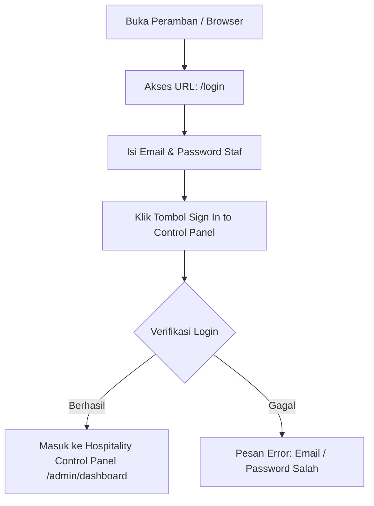
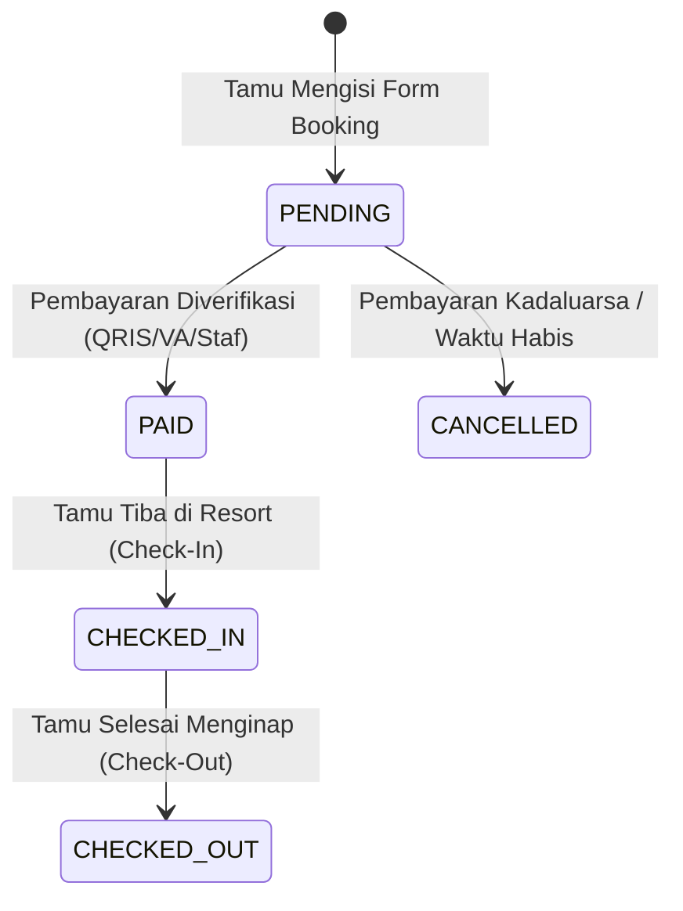

# BUKU PANDUAN PENGGUNAAN SISTEM (MANUAL BOOK)
## **Vije Boutique Resort — Luxury Hotel & Direct Booking System**

---

> **Dokumen Resmi:** Manual Book Operasional & Panduan Pengguna Sistem  
> **Target Aplikasi:** Website & Management Console Vije Boutique Resort ([www.vijeboutiqueresort.com](https://www.vijeboutiqueresort.com) / [hotel.hasanarofid.site](https://hotel.hasanarofid.site))  
> **Versi Aplikasi:** 1.0 (Quiet Luxury Edition)  
> **Penyusun:** Hasan Arofid — Senior Full-Stack & Hospitality Developer  
> **Tanggal Rilis:** September 2026  

---

## DAFTAR ISI

1. [Bab 1: Daftar Akun Login & Kredensial Akses Staf](#bab-1-daftar-akun-login--kredensial-akses-staf)
2. [Bab 2: Panduan Reservasi Tamu Publik (Guest Journey)](#bab-2-panduan-reservasi-tamu-publik-guest-journey)
3. [Bab 3: Panduan Operasional Dashboard Admin & Resepsionis](#bab-3-panduan-operasional-dashboard-admin--resepsionis)
4. [Bab 4: Panduan Manajemen Kamar & Tarif Dinamis](#bab-4-panduan-manajemen-kamar--tarif-dinamis)
5. [Bab 5: Penanganan Masalah & FAQ Operasional (Troubleshooting)](#bab-5-penanganan-masalah--faq-operasional-troubleshooting)

---

## BAB 1: DAFTAR AKUN LOGIN & KREDENSIAL AKSES STAF

Untuk mengakses panel kontrol operasional manajemen hotel (*Admin Hospitality Console*), peramban (*browser*) dapat diarahkan ke URL login resmi:
- **URL Login Admin:** `https://www.vijeboutiqueresort.com/login` atau `https://hotel.hasanarofid.site/login`

### 1.1 Tabel Matriks Kredensial Akun Default (Seeded Accounts)

Berikut adalah daftar akun staf default yang telah dikonfigurasi pada database sistem:

| Peran (Role) | Nama Pengguna | Email Login | Password Default | Target Halaman Akses | Hak Akses Utama |
| :--- | :--- | :--- | :--- | :--- | :--- |
| **Super Admin** | Super Administrator Vije | `superadmin@vijeboutiqueresort.com` | `password` | `/admin/dashboard` | Akses Penuh (Full System Access), Manajemen Akun & Konfigurasi Utama. |
| **Admin (GM)** | General Manager Admin | `admin@vijeboutiqueresort.com` | `password` | `/admin/dashboard` | Pengelolaan Operasional, Laporan Pendapatan, Okupansi, & Inventaris Kamar. |
| **Reservation Staff** | Reservation Frontdesk Staff | `reservation@vijeboutiqueresort.com` | `password` | `/admin/bookings` | Frontdesk Booking, Proses Check-In / Check-Out, & Input Direct Booking Walk-in. |
| **Finance Officer** | Finance & Accounting Lead | `finance@vijeboutiqueresort.com` | `password` | `/admin/dashboard` | Verifikasi Transaksi Pembayaran, Laporan Keuangan, & Rekonsiliasi Bank. |

> ⚠️ **CATATAN KEAMANAN PENTING:**  
> Demi keamanan sistem produksi, seluruh password default (`password`) **WAJIB diubah** oleh masing-masing staf saat pertama kali melakukan login melalui menu **Profile Settings**.

---

### 1.2 Petunjuk Langkah Login ke Panel Admin

1. Buka peramban (*Google Chrome, Mozilla Firefox, atau Safari*).
2. Ketik alamat `https://www.vijeboutiqueresort.com/login` pada address bar.
3. Masukkan **Email Login** dan **Password** sesuai tabel kredensial di atas.
4. Klik tombol **"Sign In to Control Panel"**.
5. Setelah berhasil, sistem akan mengarahkan Anda ke **Hospitality Management Console** sesuai hak akses peran Anda.

---

## BAB 2: PANDUAN RESERVASI TAMU PUBLIK (GUEST JOURNEY)

Website publik Vije Boutique Resort memfasilitasi tamu untuk melakukan pemesanan langsung (*Direct Booking Channel*) tanpa komisi OTA.

### 2.1 Alur Pemesanan Kamar di Halaman Publik (`#booking`)

Tamu dapat melakukan pemesanan mandiri melalui formulir interaktif di halaman depan:

1. **Akses Website Utama:** Tamu membuka `https://www.vijeboutiqueresort.com`.
2. **Formulir Floating Booking Bar (`#booking`):**
   - **Check In:** Pilih tanggal kedatangan.
   - **Check Out:** Pilih tanggal kepulangan (Sistem menghitung durasi malam secara otomatis).
   - **Jumlah Tamu:** Pilih jumlah tamu yang akan menginap.
   - **Pilih Kamar / Villa:** Pilih kategori akomodasi yang diinginkan (*Grand Ocean Pool Villa, Sanctuary Garden Suite, Royal Residence*). Sistem menampilkan estimasi total tarif secara real-time.
3. **Pengisian Data Tamu:**
   - **Nama Lengkap Tamu:** Sesuai KTP / Paspor.
   - **Alamat Email:** Untuk pengiriman E-Voucher digital & resi pembayaran.
   - **Nomor WhatsApp:** Untuk konfirmasi pesan instant otomatis.
   - **Permintaan Khusus (Opsional):** Catatan tambahan (misal: *Honeymoon setup, airport transfer*).
4. **Metode Pembayaran Online:**
   - Pilih **QRIS Instant** (BCA, GoPay, OVO, ShopeePay) atau **Virtual Account** (BCA, Mandiri, BRI).
5. **Konfirmasi & Penerimaan E-Voucher:**
   - Klik tombol **"Konfirmasi & Bayar Reservasi Now"**.
   - Modal E-Voucher konfirmasi akan muncul menampilkan **Kode Booking Unik (contoh: `VBR-202609-X9A2`)** dan petunjuk pembayaran.
   - Pesan konfirmasi WhatsApp akan otomatis terkirim ke ponsel tamu.

---

## BAB 3: PANDUAN OPERASIONAL DASHBOARD ADMIN & RESEPSIONIS

### 3.1 Antarmuka Utama Console (`/admin/dashboard`)

Setelah staf melakukan login, halaman dashboard menyajikan 4 kartu metrik utama:

1. **Tingkat Okupansi (%):** Persentase unit villa terisi dibandingkan total kapasitas unit resort.
2. **Pendapatan Direct (Rp):** Total nilai transaksi reservasi yang berstatus `PAID` (Lunas).
3. **Total Reservasi:** Jumlah pesanan masuk serta rincian pemesanan yang sedang aktif.
4. **Kategori Kamar:** Jumlah tipe kamar dan total unit fisik yang tersedia.

---

### 3.2 Mengelola Status Reservasi (Frontdesk Desk Workflow)

Staf resepsionis dan reservasi mengelola alur status pemesanan tamu pada menu **Reservations (`/admin/bookings`)**:

#### **Siklus Status Reservasi (Status Lifecycle):**

#### **Langkah Pengubahan Status oleh Resepsionis:**
1. Masuk ke menu **Reservations** pada sidebar kiri.
2. Cari data tamu menggunakan kolom **Search** (Ketik Nama, Kode Booking `VBR-...`, atau No. WA).
3. Pada kolom **Status**, ubah nilai dropdown sesuai kondisi fisik tamu:
   - Pilih **`PAID`**: Jika tamu telah menunjukkan bukti pembayaran lunas.
   - Pilih **`CHECKED_IN`**: Saat tamu tiba di frontdesk dan menerima kunci villa.
   - Pilih **`CHECKED_OUT`**: Saat tamu menyelesaikan proses check-out dan menyerahkan kunci.

---

## BAB 4: PANDUAN MANAJEMEN KAMAR & TARIF DINAMIS

Manajemen hotel atau General Manager dapat menambah, mengedit, atau meng-update harga kamar sesuai musim (*High Season / Low Season*) melalui menu **Rooms & Villas (`/admin/rooms`)**.

### 4.1 Mengubah Harga & Kuota Kamar

1. Buka menu **Rooms & Villas** (`/admin/rooms`).
2. Cari kartu kamar yang ingin disesuaikan (misal: *Grand Ocean Pool Villa*).
3. Klik ikon **Edit (Pensil)**.
4. Ubah nilai pada kolom:
   - **Price Per Night (Rp):** Tarif dasar per malam (misal diubah dari `4.500.000` menjadi `5.200.000` untuk peak season).
   - **Total Units:** Jumlah fisik unit kamar yang dapat disewakan.
5. Klik **"Simpan Perubahan"**.  
   *Tarif baru akan langsung berlaku secara real-time pada formulir reservasi publik.*

---

## BAB 5: PENANGANAN MASALAH & FAQ OPERASIONAL (TROUBLESHOOTING)

### Q1: Bagaimana jika tamu lupa password atau staf ingin mengganti password akun?
- **Jawaban:** Staf yang sedang login dapat mengklik nama profil di pojok kanan atas, pilih **Profile Settings**, lalu masukkan password lama dan password baru pada bagian *Update Password*.

### Q2: Tamu mengklaim sudah bayar via QRIS tetapi status di admin masih `PENDING`?
- **Penyebab:** Keterlambatan respon jaringan webhook bank/payment gateway.
- **Solusi:** Staf Resepsionis / Finance dapat memeriksa bukti transaksi tamu di aplikasi bank, lalu mengubah status reservasi secara manual dari `PENDING` menjadi **`PAID`** pada tabel `/admin/bookings`.

### Q3: Apakah dua tamu bisa memesan kamar yang sama di tanggal yang sama (*Double Booking*)?
- **Jawaban:** **Tidak bisa.** Sistem backend dilengkapi dengan *Pessimistic Database Locking* (`lockForUpdate()`). Saat satu pemesanan sedang diproses pada tanggal tersebut, kuota unit langsung dikunci secara atomic di server.

---

### **KONTAK DUKUNGAN TEKNIS**
Jika mengalami kendala operasional sistem di luar petunjuk di atas, hubungi tim teknis:

- 💬 **WhatsApp Support:** [https://Wa.me/628814959247](https://Wa.me/628814959247) (`+62 881-4959-247`)  
- 🌐 **Portfolio & Support:** [hasanarofid.site](https://hasanarofid.site)  
