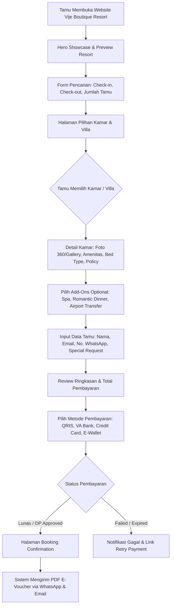
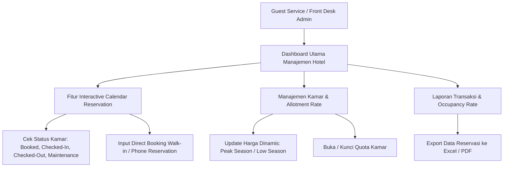
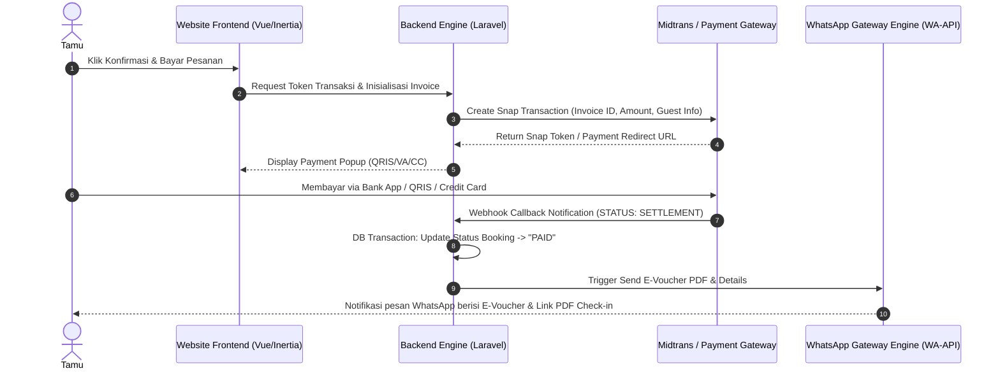

# PROPOSAL PENAWARAN REDESIGN WEBSITE & SISTEM RESERVASI HOTEL
## **Vije Boutique Resort — Luxury & Direct Booking Engine Redesign**

---

> **Dipersiapkan Untuk:**  
> **Tim Manajemen Vije Boutique Resort** (Bpk. Krisna & Tim)  
> Website Eksisting: [www.vijeboutiqueresort.com](https://www.vijeboutiqueresort.com)  
>
> **Dipersiapkan Oleh:**  
> **Hasan Arofid** — Senior Full-Stack & Hospitality Web Solution Developer  
> Website Portofolio: [hasanarofid.site](https://hasanarofid.site)  
> Kontak WhatsApp: [https://Wa.me/628814959247](https://Wa.me/628814959247)  
> Tanggal Dokumen: September 2026  

---

## 1. RINGKASAN EKSEKUTIF (EXECUTIVE SUMMARY)

**Vije Boutique Resort** merupakan destinasi hunian resort eksklusif yang menawarkan pengalaman menginap nan tenang, elegan, dan kaya akan keindahan alam. Dalam industri *luxury hospitality* modern, tampilan website bukan sekadar brosur digital, melainkan **kesan pertama (*first impression*)** sekaligus pintu utama penggerak reservasi langsung (*direct booking*) yang bebas komisi pihak ketiga (OTA).

Melalui proposal ini, kami mengajukan solusi **Redesign Total Tampilan Website & Modernisasi Pengalaman Pengguna (UX)** Vije Boutique Resort dengan mengusung standar visual **"Quiet Luxury Boutique Resort"** (inspirasi **Aman Resorts & Kempinski Hotels**) — memadukan keanggunan minimalis (*understated luxury*), ritme visual alami, typography kelas dunia, serta *booking engine* yang intuitif, cepat, dan transaksional.

### Target Utama Redesign:
1. **Elevasi Citra Visual (Aman & Kempinski Style):** Mengubah tampilan fisik digital resort agar mencerminkan kemewahan *5-star boutique luxury*, kaya visual immersive (foto/video resolusi tinggi, micro-animations, typography serif yang elegan).
2. **Optimalisasi Direct Booking Rate:** Memudahkan calon tamu memilih kamar, mengecek ketersediaan tanggal, serta melakukan pembayaran langsung secara instan tanpa hambatan.
3. **Efisiensi Operasional & Integrasi Notifikasi:** Mengintegrasikan konfirmasi otomatis via WhatsApp Instant Messaging & Email Resi PDF.
4. **Performa & Mobile First:** Website dapat diakses sangat cepat di perangkat smartphone, laptop, maupun tablet dengan skor Core Web Vitals optimal.

---

## 2. KONSEP DESAIN: AMAN & KEMPINSKI LUXURY INSPIRATION

```
  +-----------------------------------------------------------------------+
  |                        Visual Identity Standard                       |
  +-----------------------------------------------------------------------+
  |  [ Aman Style ]      : Minimalis, Tenang, Earthy Tones, Immersive     |
  |  [ Kempinski Style ] : Elegansi Klasik-Modern, Presisi, Exclusivity   |
  |  [ Principle ]       : "Less, But Better" (Quiet Luxury)              |
  +-----------------------------------------------------------------------+
```

### A. Estetika & Palette Warna (Earthy Luxury Colors)
- **Primary Color:** Warm Ivory (`#FAF8F5`), Cream (`#F4EFE6`), Sand (`#E6DEC9`), Warm Beige (`#D9CEB2`).
- **Secondary Color:** Deep Forest Green (`#1C2826`), Dark Olive (`#2B3023`), Charcoal (`#1A1A1A`).
- **Accent Color:** Muted Gold / Bronze (`#C5A059`).
- **Background Color:** Off White / Warm Ivory (`#FDFBF7`) & Deep Obsidian Onyx (`#121212`) untuk Dark Accents.

### B. Tipografi & Tata Letak
- **Heading Font:** *Cormorant Garamond* / *Playfair Display* / *Cinzel* (Serif mewah khas majalah gaya hidup premium).
- **Body Font:** *Plus Jakarta Sans* / *Inter* / *Manrope* (San-serif bersih, sangat legibel untuk reservasi & rincian fasilitas).
- **Layout Rhythm:** Full-width hero videos/sliders, *white space* yang luas (generous whitespace), dan galeri foto berbasis masonry grid interaktif.

---

## 3. BISNIS PROSES SISTEM HOTEL (HOTEL SYSTEM BUSINESS PROCESS)

Sistem hotel yang dirancang mencakup 3 pilar alur utama: **Alur Tamu (Guest Journey)**, **Alur Manajemen (Admin Operation Flow)**, dan **Engine Integrasi Transaksi & Notifikasi**.

### A. Flow 1: Alur Reservasi Tamu (Guest Direct Booking Journey)



#### Penjelasan Tahapan Tamu:
1. **Pencarian Real-time:** Tamu memasukkan tanggal menginap dan jumlah tamu. Sistem langsung memfilter kamar yang *available*.
2. **Transparansi Tarif & Rate Plan:** Tamu melihat rincian harga transparan (misal: *Best Available Rate*, *With Breakfast*, *Non-Refundable Special*).
3. **Ekstra Layanan (Add-ons Service):** Tamu dapat menambahkan paket romantis, transfer bandara, atau layanan spa sebelum checkout.
4. **Checkout Instan & QRIS/VA:** Integrasi ke Payment Gateway nasional/internasional sehingga tamu lokal maupun mancanegara dapat membayar dengan mudah.
5. **Voucher Digital Instan:** E-voucher terbit otomatis berformat QR Code, terkirim langsung ke WhatsApp tamu tanpa menunggu konfirmasi manual admin.

---

### B. Flow 2: Alur Operasional Manajemen Hotel (Admin & Front Desk Flow)



---

### C. Flow 3: Engine Integrasi Payment Gateway & WhatsApp Automatic Notification



---

## 4. CAKUPAN MODUL & FITUR UTAMA SISTEM REDESIGN

| No | Modul / Layanan | Deskripsi & Keunggulan Fitur |
|:--:|:---|:---|
| **1** | **Luxury Landing Page** | Redesign halaman utama dengan gaya Kempinski/Aman: Hero Video Loop, Narrative Storytelling Resort, Floating Booking Bar, Curated Photo Gallery. |
| **2** | **Rooms & Suites Showcase** | Showcase visual interaktif setiap kamar/villa lengkap dengan High-Res Slider, Daftar Amenitas, View Type, Ukuran Kamar, dan Floor Plan. |
| **3** | **Integrated Direct Booking Engine** | Engine pemesanan kamar serba otomatis: Pencarian tanggal real-time, kalkulasi pajak & service charge, pemrosesan voucher promo/diskon. |
| **4** | **Dining & Wellness Experience** | Halaman khusus promosi Restoran, Bar, Spa, & Aktivitas Eksklusif Resort dengan penambahan fitur *Reserve Table / Spa Slot*. |
| **5** | **Automated Payment Gateway** | Integrasi Midtrans / Xendit mendukung Payment Virtual Account (BCA, Mandiri, BRI, BNI), QRIS, Credit Card (Visa/Mastercard), dan E-Wallet. |
| **6** | **WhatsApp Notification Engine** | Pengiriman otomatis e-voucher, rincian reservasi, lokasi Google Maps resort, dan petunjuk check-in ke WhatsApp tamu saat pembayaran berhasil. |
| **7** | **Admin Control Panel** | Dashboard mengelola data reservasi, pengaturan harga kamar, laporan pendapatan, kalender okupansi, dan data tamu (CRM Sederhana). |
| **8** | **SEO Hospitality & Mobile Speed** | Optimasi kata kunci Google (misal: *"Luxury Resort in Bali"*, *"Boutique Villa Reservation"*), struktur schema.org Hotel, & kecepatan loading super cepat. |

---

## 5. BLUEPRINT AUDIT & SPESIFIKASI PROMPT DESAIN AI (22 POIN)

Sebagai jaminan kualitas hasil redesign visual, seluruh implementasi mengikuti spesifikasi berikut:

1. **Brand Positioning:** *"Quiet Luxury Boutique Resort"* — Minimal, Organic, Natural, Timeless, Editorial.
2. **Strict Avoidances:** Tanpa gradient berisik, tanpa border/shadow berat, tanpa tampilan kaku khas OTA.
3. **Typography Standard:** Display Serif (*Cormorant Garamond / Playfair Display*) + Body Sans-Serif (*Inter / Plus Jakarta Sans*).
4. **Color Palette:** Warm Ivory, Sand, Deep Forest Green, Charcoal, Accent Muted Gold (`#C5A059`).
5. **Full-screen Immersive Hero:** Tagline *"Where Luxury Meets Serenity"*, minimal navigation, smooth slow zoom & fade-in typography.
6. **Editorial Introduction:** *"An intimate retreat designed for those who appreciate the beauty of slow living"*.
7. **Rooms & Villas Layout:** Editorial 1-featured accommodation + supporting suites (bukan sekadar card grid biasa).
8. **Experience & Dining Section:** Menjual suasana private dining, spa treatment, pool, & local culture.
9. **Editorial Masonry Gallery:** Foto resolusi tinggi gaya majalah *luxury travel*.
10. **Location Storytelling:** Peta interaktif & rincian perjalanan menuju resort.
11. **Minimalist Guest Testimonials:** Quote typography yang seimbang dan tenang.
12. **Conversion Strategy:** Section *"Your Private Escape Awaits"* dengan CTA *"Book Your Stay"*.
13. **Responsive Breakpoints:** Teruji presisi di Mobile 390px/430px, Tablet, Laptop 1366px, & Desktop 1440px/1920px.
14. **Subtle Animation Standard:** Smooth fade-up, image reveal, slow parallax (durasi 400ms–1000ms).
15. **Performa High-Speed:** WebP/AVIF images, lazy loading, LCP hero optimization, Core Web Vitals tinggi.

---

## 6. RENCANA KERJA & TIMELINE EKSEKUSI (PROJECT ROADMAP)

```
[Minggu 1] : Discovery, Wireframing & Approval UI/UX Concept (Aman/Kempinski Style)
[Minggu 2] : Redesign Frontend (Vue 3 / Inertia / Tailwind CSS) & Responsivitas Mobile
[Minggu 3] : Integrasi Booking Engine, Midtrans Payment Gateway & WA Engine
[Minggu 4] : Quality Assurance (QA), Core Web Vitals Testing, User Acceptance Test (UAT) & Launching
```

---

## 7. RINCIAN PENAWARAN HARGA & PAKET INVESTASI (COMMERCIAL PROPOSAL)

Kami menawarkan 3 pilihan paket investasi pengembangan yang dapat disesuaikan dengan skala prioritas dan target operasional Vije Boutique Resort:

### A. Tabel Skema Paket Investasi

| Fitur & Layanan | Paket Standard | Paket Professional ⭐ *(RECOMMENDED)* | Paket Enterprise |
| :--- | :---: | :---: | :---: |
| **Redesign Tampilan Publik (Quiet Luxury)** | ✅ Ya | ✅ Ya | ✅ Ya |
| **Direct Booking Engine (Form #booking)** | ✅ Ya | ✅ Ya | ✅ Ya |
| **Integrasi Payment Gateway (QRIS, VA, CC)** | ✅ Ya | ✅ Ya | ✅ Ya |
| **Mobile-First & Core Web Vitals Optimization** | ✅ Ya | ✅ Ya | ✅ Ya |
| **Quiet Luxury Admin Management Console** | ❌ Tidak | ✅ Ya | ✅ Ya |
| **Manajemen Kamar, Rate Dinamis & Kuota** | ❌ Tidak | ✅ Ya | ✅ Ya |
| **Role-Based Access Control (5 RBAC Roles)** | ❌ Tidak | ✅ Ya | ✅ Ya |
| **WhatsApp Automated E-Voucher & Email Resi** | ❌ Tidak | ✅ Ya | ✅ Ya |
| **Audit Logging & Export Laporan Keuangan** | ❌ Tidak | ✅ Ya | ✅ Ya |
| **Integrasi Multi-Branch & Custom PMS API** | ❌ Tidak | ❌ Tidak | ✅ Ya |
| **Masa Garansi & Pemeliharaan System** | 3 Bulan | **6 Bulan** | 12 Bulan |
| **Sesi Pelatihan (Training) Staf Hotel** | 1 Sesi | **2 Sesi** | Unlimited |
| **NILAI INVESTASI (IDR)** | **Rp 17.500.000** | **Rp 28.500.000** | **Rp 45.000.000** |

---

### B. Biaya Layanan Pihak Ketiga & Infrastruktur (Estimasi Operasional)

| Komponen Layanan | Biaya / Tarif | Keterangan & Provider |
| :--- | :--- | :--- |
| **Cloud VPS Server & Domain SSL** | **Rp 2.500.000 / Tahun** | *GRATIS 1 Tahun Pertama* (High Availability SSD, Daily Backup, Wildcard SSL). |
| **Payment Gateway Account (Midtrans / Xendit)** | **Rp 0 (Tanpa Registration Fee)** | Komisi per transaksi disettle langsung oleh provider (QRIS ~0.7%, Virtual Account ~Rp 4.000/trx). |
| **WhatsApp API Notification Engine** | **Sesuai Pemakaian Pesan** | Integrasi WA-Gateway untuk pengiriman E-Voucher & Resi. |

---

### C. Skema Termin Pembayaran (Payment Terms)

Untuk menjamin kenyamanan dan transparansi pengerjaan proyek, pembayaran dilakukan dalam **3 Termin (Milestone-based Payment)**:

1. **Termin 1 — Down Payment (40%):**
   - Dibayarkan saat penandatanganan kesepakatan (MoU) & Kick-off pengerjaan proyek.
   - *Pekerjaan:* Riset visual, wireframing, dan pembentukan struktur dasar database.
2. **Termin 2 — Milestone Development (40%):**
   - Dibayarkan setelah seluruh pengembangan Frontend Quiet Luxury, Backend REST API, dan sistem integrasi selesai disajikan di environment Staging.
   - *Pekerjaan:* Pengujian alur booking, verifikasi payment gateway, dan penyempurnaan responsivitas mobile.
3. **Termin 3 — Pelunasan & Go-Live (20%):**
   - Dibayarkan setelah tahapan *User Acceptance Test (UAT)* disetujui, pelatihan staf hotel selesai, dan sistem resmi diluncurkan secara *Live* pada domain utama resort.

---

### D. Garansi & Dukungan Layanan Purna Jual (Support & Guarantee)

- 🛡️ **Garansi Bebas Bug (6 Bulan):** Garansi penuh perbaikan jika terjadi kesalahan teknis atau bug sistem pasca launching.
- 🎓 **Pelatihan Staf Hotel (Training Session):** Pembekalan langsung bagi tim *Frontdesk*, *General Manager*, dan *Finance* dalam mengoperasikan panel admin.
- 💾 **Automated Database Backup:** Konfigurasi pembackupan database otomatis harian untuk mencegah kehilangan data reservasi.

---

## 8. PORTOFOLIO & KAPABILITAS PENGEMBANG (PORTFOLIO SHOWCASE)

Sebagai **Senior Full-Stack Developer**, saya memiliki spesialisasi dalam membangun sistem web modern, performa tinggi, dan terintegrasi payment gateway serta otomasi notifikasi.

> Portofolio lengkap dan karya web aplikasi interaktif lainnya dapat dilihat langsung di website resmi saya: **[hasanarofid.site](https://hasanarofid.site)**

---

### **INFORMASI KONTAK & KONSULTASI**
Jika ada pertanyaan atau bagian dari penawaran harga ini yang ingin disesuaikan dengan budget manajemen Vije Boutique Resort, silakan hubungi kami melalui:

- 💬 **WhatsApp:** [https://Wa.me/628814959247](https://Wa.me/628814959247) (`+62 881-4959-247`)  
- 🌐 **Website:** [hasanarofid.site](https://hasanarofid.site)  

*Kami siap membantu meretas potensi penuh digitalisasi dan keindahan Vije Boutique Resort!*
