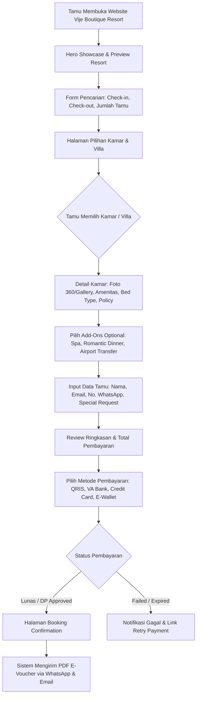
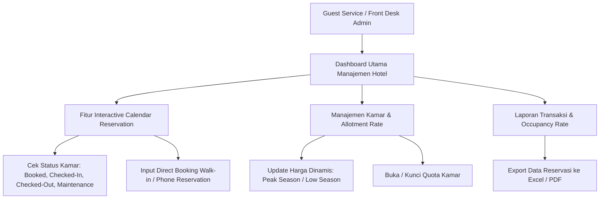
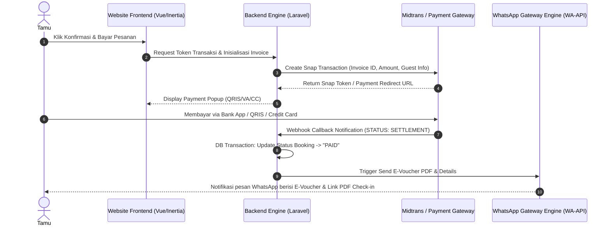

# PROPOSAL PENAWARAN REDESIGN WEBSITE & SISTEM RESERVASI HOTEL
## **Vije Boutique Resort — Luxury & Direct Booking Engine Redesign**

---

> **Dipersiapkan Untuk:**  
> **Tim Manajemen Vije Boutique Resort** (Bpk. Krisna & Tim)  
> Website Eksisting: [www.vijeboutiqueresort.com](https://www.vijeboutiqueresort.com)  
>
> **Dipersiapkan Oleh:**  
> **Hasan Arofid** — Senior Full-Stack & Hospitality Web Solution Developer  
> Website Portofolio: [hasanarofid.site](https://hasanarofid.site)  
> Kontak WhatsApp: [https://Wa.me/628814959247](https://Wa.me/628814959247)  
> Tanggal Dokumen: September 2026  

---

## 1. RINGKASAN EKSEKUTIF (EXECUTIVE SUMMARY)

**Vije Boutique Resort** merupakan destinasi hunian resort eksklusif yang menawarkan pengalaman menginap nan tenang, elegan, dan kaya akan keindahan alam. Dalam industri *luxury hospitality* modern, tampilan website bukan sekadar brosur digital, melainkan **kesan pertama (*first impression*)** sekaligus pintu utama penggerak reservasi langsung (*direct booking*) yang bebas komisi pihak ketiga (OTA).

Melalui proposal ini, kami mengajukan solusi **Redesign Total Tampilan Website & Modernisasi Pengalaman Pengguna (UX)** Vije Boutique Resort dengan mengusung standar visual **Aman Resorts & Kempinski Hotels** — memadukan keanggunan minimalis (*understated luxury*), ritme visual alami, typography kelas dunia, serta *booking engine* yang intuitif, cepat, dan transaksional.

### Target Utama Redesign:
1. **Elevasi Citra Visual (Aman & Kempinski Style):** Mengubah tampilan fisik digital resort agar mencerminkan kemewahan *5-star boutique luxury*, kaya visual immersive (foto/video resolusi tinggi, micro-animations, typography serif yang elegan).
2. **Optimalisasi Direct Booking Rate:** Memudahkan calon tamu memilih kamar, mengecek ketersediaan tanggal, serta melakukan pembayaran langsung secara instan tanpa hambatan.
3. **Efisiensi Operasional & Integrasi Notifikasi:** Mengintegrasikan konfirmasi otomatis via WhatsApp Instant Messaging & Email Resi PDF.
4. **Performa & Mobile First:** Website dapat diakses sangat cepat di perangkat smartphone, laptop, maupun tablet dengan skor Core Web Vitals optimal.

---

## 2. KONSEP DESAIN: AMAN & KEMPINSKI LUXURY INSPIRATION

```
  +-----------------------------------------------------------------------+
  |                        Visual Identity Standard                       |
  +-----------------------------------------------------------------------+
  |  [ Aman Style ]      : Minimalis, Tenang, Earthy Tones, Immersive     |
  |  [ Kempinski Style ] : Elegansi Klasik-Modern, Presisi, Exclusivity   |
  +-----------------------------------------------------------------------+
```

### A. Estetika & Palette Warna (Earthy Luxury Colors)
- **Primary Color:** Deep Bronze / Muted Gold (`#C5A059`) — Menyuarakan eksklusivitas & kehangatan.
- **Background Color:** Soft Warm Sand / Warm Cream (`#FDFBF7`) & Deep Obsidian Onyx (`#171717`) untuk Dark Accents.
- **Secondary Accent:** Forest Sage & Warm Charcoal (`#2C3531`) — Mencerminkan alam & ketenangan khas resort.

### B. Tipografi & Tata Letak
- **Heading Font:** *Cormorant Garamond* / *Cinzel* (Serif mewah khas majalah gaya hidup premium).
- **Body Font:** *Plus Jakarta Sans* / *Inter* (San-serif bersih, sangat legibel untuk reservasi & rincian fasilitas).
- **Layout Rhythm:** Full-width hero videos/sliders, *white space* yang luas (generous whitespace), dan galeri foto berbasis masonry grid interaktif.

---

## 3. BISNIS PROSES SISTEM HOTEL (HOTEL SYSTEM BUSINESS PROCESS)

Sistem hotel yang dirancang mencakup 3 pilar alur utama: **Alur Tamu (Guest Journey)**, **Alur Manajemen (Admin Operation Flow)**, dan **Engine Integrasi Transaksi & Notifikasi**.

### A. Flow 1: Alur Reservasi Tamu (Guest Direct Booking Journey)



#### Penjelasan Tahapan Tamu:
1. **Pencarian Real-time:** Tamu memasukkan tanggal menginap dan jumlah tamu. Sistem langsung memfilter kamar yang *available*.
2. **Transparansi Tarif & Rate Plan:** Tamu melihat rincian harga transparan (misal: *Best Available Rate*, *With Breakfast*, *Non-Refundable Special*).
3. **Ekstra Layanan (Add-ons Service):** Tamu dapat menambahkan paket romantis, transfer bandara, atau layanan spa sebelum checkout.
4. **Checkout Instan & QRIS/VA:** Integrasi ke Payment Gateway nasional/internasional sehingga tamu lokal maupun mancanegara dapat membayar dengan mudah.
5. **Voucher Digital Instan:** E-voucher terbit otomatis berformat QR Code, terkirim langsung ke WhatsApp tamu tanpa menunggu konfirmasi manual admin.

---

### B. Flow 2: Alur Operasional Manajemen Hotel (Admin & Front Desk Flow)



#### Penjelasan Tahapan Operasional Hotel:
1. **Visual Reservation Calendar:** Tampilan kalender interaktif untuk melihat okupansi kamar harian/bulanan secara sekilas.
2. **Manajemen Tarif Dinamis (Dynamic Pricing):** Admin dapat mengubah harga kamar atau membuat diskon promosi khusus musim liburan (*High Season*) dalam hitungan detik.
3. **Manajemen Status Kamar:** Memudahkan tim *housekeeping* dan *receptionist* memantau ketersediaan kamar yang siap huni.

---

### C. Flow 3: Engine Integrasi Payment Gateway & WhatsApp Automatic Notification



---

## 4. CAKUPAN MODUL & FITUR UTAMA SISTEM REDESIGN

| No | Modul / Layanan | Deskripsi & Keunggulan Fitur |
|:--:|:---|:---|
| **1** | **Luxury Landing Page** | Redesign halaman utama dengan gaya Kempinski/Aman: Hero Video Loop, Narrative Storytelling Resort, Floating Booking Bar, Curated Photo Gallery. |
| **2** | **Rooms & Suites Showcase** | Showcase visual interaktif setiap kamar/villa lengkap dengan High-Res Slider, Daftar Amenitas, View Type, Ukuran Kamar, dan Floor Plan. |
| **3** | **Integrated Direct Booking Engine** | Engine pemesanan kamar serba otomatis: Pencarian tanggal real-time, kalkulasi pajak & service charge, pemrosesan voucher promo/diskon. |
| **4** | **Dining & Wellness Experience** | Halaman khusus promosi Restoran, Bar, Spa, & Aktivitas Eksklusif Resort dengan penambahan fitur *Reserve Table / Spa Slot*. |
| **5** | **Automated Payment Gateway** | Integrasi Midtrans / Xendit mendukung Payment Virtual Account (BCA, Mandiri, BRI, BNI), QRIS, Credit Card (Visa/Mastercard), dan E-Wallet. |
| **6** | **WhatsApp Notification Engine** | Pengiriman otomatis e-voucher, rincian reservasi, lokasi Google Maps resort, dan petunjuk check-in ke WhatsApp tamu saat pembayaran berhasil. |
| **7** | **Admin Control Panel** | Dashboard mengelola data reservasi, pengaturan harga kamar, laporan pendapatan, kalender okupansi, dan data tamu (CRM Sederhana). |
| **8** | **SEO Hospitality & Mobile Speed** | Optimasi kata kunci Google (misal: *"Luxury Resort in Bali"*, *"Boutique Villa Reservation"*), struktur schema.org Hotel, & kecepatan loading super cepat. |

---

## 5. RENCANA KERJA & TIMELINE EKSEKUSI (PROJECT ROADMAP)

Estimasi total durasi pengerjaan adalah **3 hingga 4 Minggu** dengan tahapan yang terukur:

```
[Minggu 1] : Discovery, Wireframing & Approval UI/UX Concept (Aman/Kempinski Style)
[Minggu 2] : Redesign Frontend (Vue 3 / Inertia / Tailwind CSS) & Responsivitas Mobile
[Minggu 3] : Integrasi Booking Engine, Midtrans Payment Gateway & WA Engine
[Minggu 4] : Quality Assurance (QA), Core Web Vitals Testing, User Acceptance Test (UAT) & Launching
```

---

## 6. PORTOFOLIO & KAPABILITAS PENGEMBANG (PORTFOLIO SHOWCASE)

Sebagai **Senior Full-Stack Developer**, saya memiliki spesialisasi dalam membangun sistem web modern, performa tinggi, dan terintegrasi payment gateway serta otomasi notifikasi.

### Highlight Pengalaman & Proyek Relevan:
1. **Hospitality & Luxury Booking Platform Design:**
   - Pengalaman merancang antarmuka web modern dengan fokus pada konversi reservasi tinggi, performa kilat, dan estetika visual tingkat tinggi.
2. **Engine Transaksi & Payment Gateway Integration:**
   - Pengalaman mengintegrasikan Midtrans Payment Gateway (Virtual Account, QRIS, Credit Card) dengan penanganan webhook idempoten aman terbebas dari kesalahan transaksi.
3. **Automated WhatsApp Notification Gateway:**
   - Pengalaman membangun engine notifikasi WhatsApp otomatis untuk konfirmasi invoice, pengiriman e-voucher PDF, dan reminder sistem.
4. **Teknologi Stack Teruji & Modern:**
   - **Backend:** Laravel 11 (PHP 8.2+) — Andal, aman, dan mudah dipelihara.
   - **Frontend:** Vue 3 (Inertia.js), Tailwind CSS, Framer Motion / Smooth Animations.
   - **Database:** MySQL / PostgreSQL.

> Portofolio lengkap dan karya web aplikasi interaktif lainnya dapat dilihat langsung di website resmi saya: **[hasanarofid.site](https://hasanarofid.site)**

---

## 7. PENUTUP & REKOMENDASI TAHAP SELANJUTNYA

Redesign tampilan Vije Boutique Resort berkonsep **Kempinski & Aman Luxury Style** akan menaikkan posisi (*brand positioning*) resort di tingkat internasional, menarik perhatian tamu *high-end*, serta meningkatkan secara signifikan porsi reservasi langsung (*direct booking*).

### Rekomendasi Langkah Selanjutnya:
1. **Diskusi & Alignment Konsep Visual:** Konfirmasi preferensi visual (foto resort, tone warna, dan referensi kamar).
2. **Penyusunan Mockup UI/UX Initial:** Pembuatan draft awal desain halaman depan (*Home*) & *Booking Bar*.
3. **Kesepakatan Kerjasama & Penandatanganan MoU Project.**

---

### **INFORMASI KONTAK & KONSULTASI**
Jika ada pertanyaan atau bagian dari proposal ini yang ingin disesuaikan, silakan hubungi kami melalui:

- 💬 **WhatsApp:** [https://Wa.me/628814959247](https://Wa.me/628814959247) (`+62 881-4959-247`)  
- 🌐 **Website:** [hasanarofid.site](https://hasanarofid.site)  

*Kami siap membantu meretas potensi penuh digitalisasi dan keindahan Vije Boutique Resort!*
